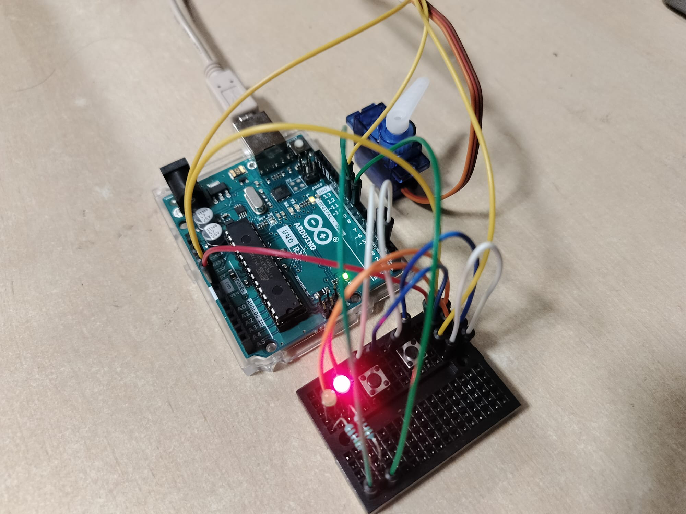
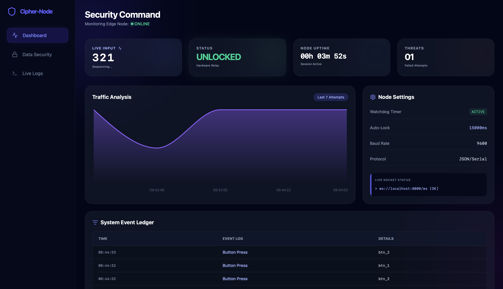
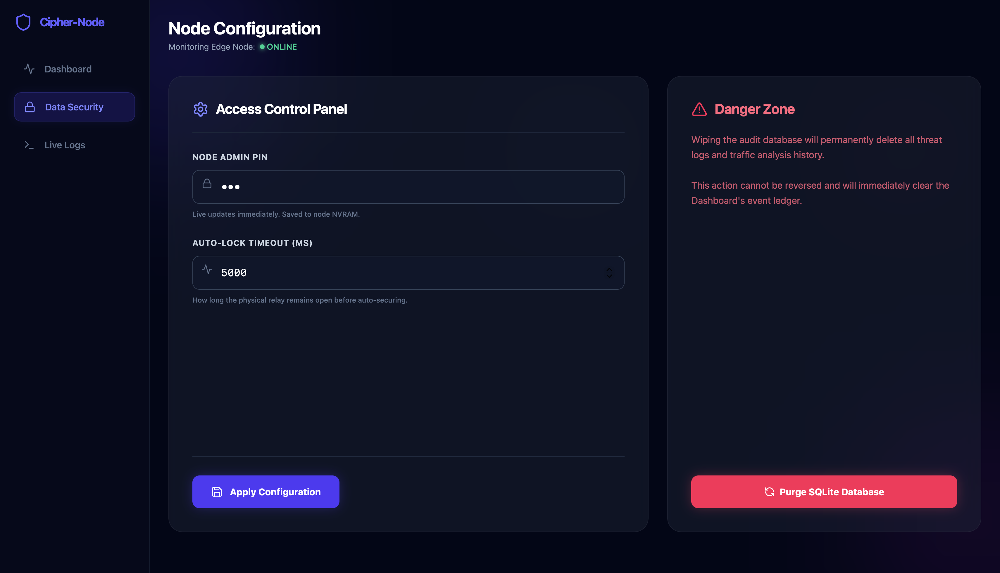
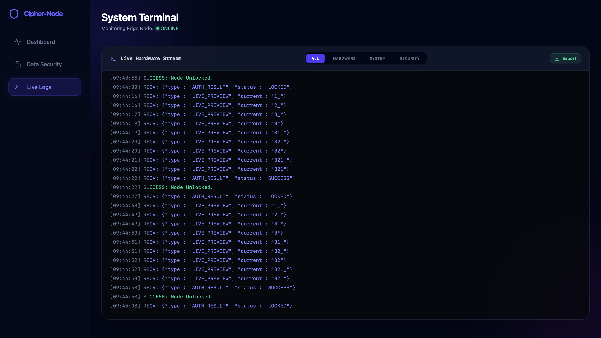

# Cipher-Node

> Zero-trust IoT edge node featuring a C++ physical relay, Python WebSocket brain, and a live React glassmorphism dashboard.

Cipher-Node bridges the gap between physical hardware and high-end web architecture. By strictly enforcing a "Dumb Terminal" philosophy on the hardware, the Python backend securely manages all access controls, audit logging, and hardware timeouts locally. This data is then broadcast in real-time to a modern, cyber-security styled React dashboard.

---

## Hardware Interface

The physical layer is driven by an Arduino microcontroller. It holds zero programmatic logic regarding passwords or security; it merely acts as a conduit, reading physical inputs and executing commands sent from the central server.

| Locked State (System Secured) | Unlocked State (Access Granted) |
| :---: | :---: |
|  |  |
| *Red LED active, servo engaged at 0 degrees. Awaiting input.* | *Green LED active, servo disengaged at 90 degrees.* |

* **Watchdog Deadman Switch:** The hardware expects a ping from the server every 2 seconds during an unlocked state. If the server crashes or the USB is disconnected, the hardware assumes a breach and physically slams the servo shut after 5 seconds, defaulting to maximum security.

---

## Command Centre Dashboard

The frontend is a React application built with Vite and Tailwind CSS v4, utilising a deep-navy glassmorphism aesthetic. It connects to the Python server via WebSockets for zero-latency telemetry.

| Security Dashboard | Configuration Panel | Live Terminal |
| :---: | :---: | :---: |
|  |  |  |
| **Real-Time Analytics:** Displays live hardware input sequencing, visualises the last 7 access attempts via Recharts, and features a live System Event Ledger pulling directly from SQLite. | **Node Settings:** Allows administrators to dynamically rewrite the backend `.env` configuration (PIN and timeouts) on the fly, and includes a secure interface to purge the audit database. | **Telemetry Stream:** A dedicated terminal interface streaming raw JSON packets directly from the hardware and backend. Includes interactive filters to isolate hardware, system, or security events, plus CSV export functionality. |

---

## Architecture & Data Flow

Cipher-Node operates across three highly isolated layers to ensure security and stability:

1. **The Edge Node (`/firmware`)**
   - A C++ Arduino environment operating purely as a sensor and relay.
   - Blindly reads physical button states (Cycle and Enter) and transmits them as JSON over Serial USB.

2. **The Brain (`/backend`)**
   - A Python FastAPI server acting as the absolute logic controller.
   - **Auto-Discovery:** Automatically scans host USB ports to locate and bind to the Arduino upon boot.
   - **Validation & Brute-Force Protection:** Parses incoming JSON, validates the access PIN against a local `.env` file, and enforces a 60-second system lockout if 3 consecutive incorrect attempts are detected.
   - **Audit Logging:** Maintains a local SQLite database (`audit_log.sqlite3`) to track threat analysis, unlock attempts, and hardware triggers.

3. **The Command Centre (`/frontend`)**
   - Subscribes to the FastAPI WebSocket to render live data without polling delays.
   - Communicates back to the Python server via REST endpoints to fetch historical analytics or update configuration files.

---

## File Structure

    Cipher-Node/
    ├── backend/                  # The Logic Controller
    │   ├── .env                  # Environment secrets & configuration
    │   ├── database.py           # SQLite initialisation and queries
    │   └── main.py               # FastAPI server, Serial parser & Auto-Discovery
    ├── firmware/                 # The Dumb Terminal
    │   └── CipherNode.ino        # C++ hardware relay code
    ├── frontend/                 # The Command Centre
    │   ├── src/                  # React UI components & Tailwind CSS
    │   ├── index.html            # Vite entry point
    │   ├── package.json          # Node dependencies
    │   ├── postcss.config.js     # Tailwind v4 configuration
    │   └── vite.config.js        # Vite build configuration

---

## Quick Start Guide

To ensure proper data flow, the system must be initialised in the following specific order: Hardware $\rightarrow$ Backend $\rightarrow$ Frontend.

### Step 1: Hardware Initialisation
1. Connect your Arduino microcontroller to your machine via USB.
2. Open `firmware/CipherNode.ino` in the **Arduino IDE** (or your preferred C++ compiler).
3. Verify your pin mappings (Buttons on Pins 2 & 3, LEDs on 8 & 9, Servo on Pin 10).
4. **Compile and Upload** the sketch to the board. Ensure the Arduino IDE Serial Monitor is closed after uploading to free up the COM port.

### Step 2: Backend Server (The Brain)
Navigate to the backend directory and install the necessary Python packages. Python 3.8+ is required.

    cd backend
    pip install fastapi uvicorn pyserial websockets pydantic python-dotenv

Create a `.env` file in the `backend` directory. *(Note: You do not need to specify your Serial Port; the Python server features an auto-discovery protocol that will find the Arduino automatically).*

    SAFE_CODE=321
    AUTO_LOCK=5000

Boot the central logic server:

    python3 -m uvicorn main:app --reload

### Step 3: Frontend Dashboard (The UI)
Open a new terminal window, navigate to the frontend directory, and install the Node modules.

    cd frontend
    npm install
    npm run dev

Open `http://localhost:5173` in your web browser. The dashboard will automatically establish a WebSocket connection with the backend and synchronise with the hardware.

---

## Key Security Features

* **State Isolation:** Passwords are never stored on the physical device. If the hardware is stolen or dismantled, no credentials can be extracted.
* **Brute-Force Lockout:** The Python server monitors failed attempts. Upon 3 consecutive failures, the backend ignores all physical inputs for 60 seconds and broadcasts a lockdown alert to the dashboard.
* **NVRAM Live Updates:** The UI can dynamically rewrite the backend `.env` file via secure POST requests, allowing administrators to update access codes and relay timeouts instantly without a hard server reboot.
* **Immutable Audit Logging:** Every physical interaction, hardware timeout, and configuration change is tracked, permanently logged in SQLite, and streamable in the raw Live Logs terminal.